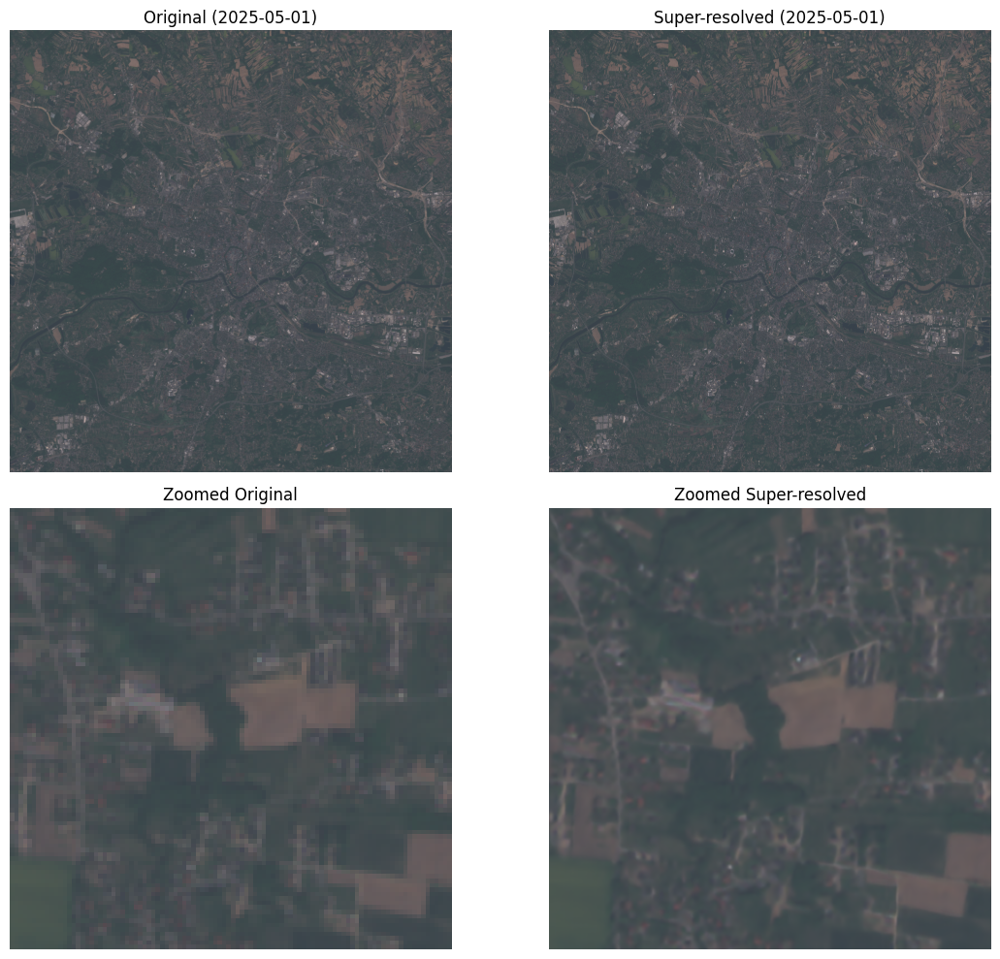

# Super Resolution
## What is Super Image Resolution
Super image resolution is a technique that enhances the spatial resolution of satellite images, allowing finer details to be extracted from medium-resolution data such as Sentinel-2. This is especially valuable in water quality monitoring, where detecting small features like narrow shorelines, small-scale pollution, or localized algae blooms can make a significant difference.

In our project, we utilize the **[SEN2SR model](https://github.com/ESAOpenSR/SEN2SR)** developed by ESA OpenSR. This model applies deep learning-based super-resolution techniques to generate high-resolution (2.5m) outputs from original Sentinel-2 bands.

## How SEN2SR Helps

- **Enhanced clarity**: Improves visibility of smaller inland water bodies and shoreline structures.
- **Better feature extraction**: Helps identify spatially small variations in water quality indicators like chlorophyll-a or turbidity.
- **Data consistency**: Upscaled bands allow unified analysis across all Sentinel-2 spectral channels.

*Upscaled Sentinel-2 image showing enhanced detail*

> Learn more or access the model here: [github.com/ESAOpenSR/SEN2SR](https://github.com/ESAOpenSR/SEN2SR)