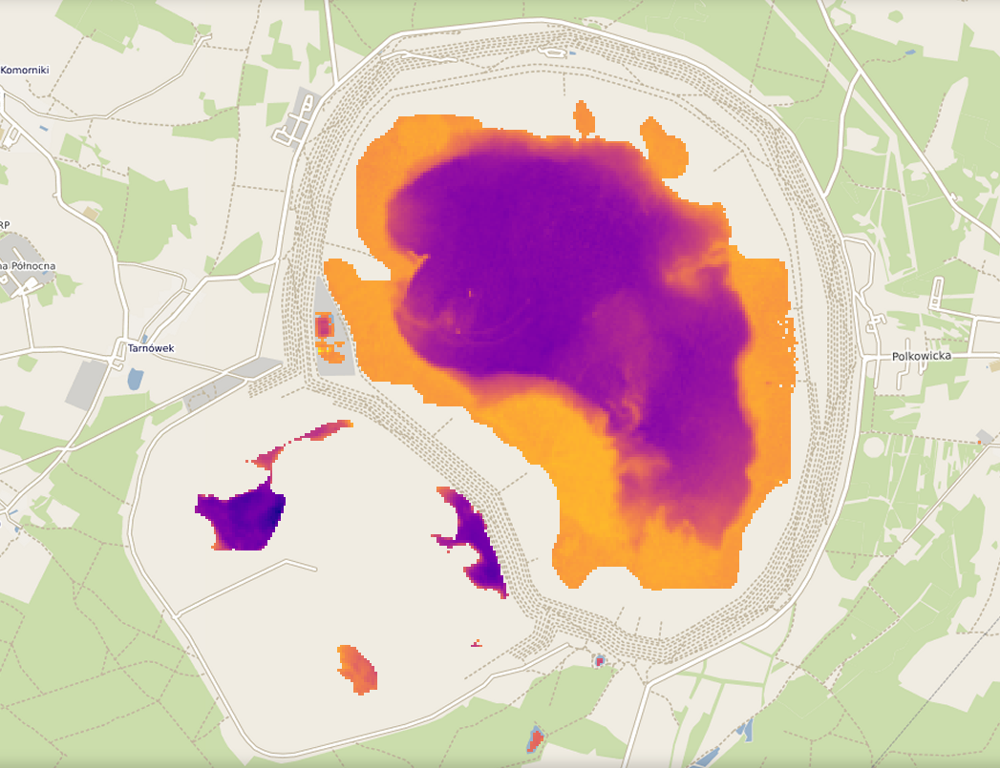

# Colored Dissolved Organic Matter (CDOM)

CDOM refers to organic molecules dissolved in water that absorb light, especially in the blue part of the spectrum. It affects water color and influences light penetration, which is important for aquatic life.

Monitoring CDOM helps track organic pollution and water clarity.

*Żelazny Most (Near Lubina) - colored dissolved organic matter (CDOM - Se2WaQ)*

