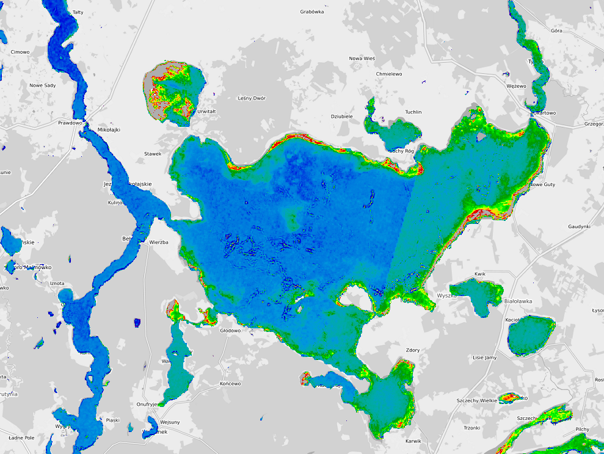

# Chlorophyll-a

Chlorophyll-a is a pigment found in phytoplankton and algae. It’s used as a key indicator of algal biomass and primary productivity.

High levels can indicate nutrient pollution (eutrophication), potentially leading to harmful algal blooms.

*Śniardwy Lake Chloropyll-a(Chl_a Se2WaQ)*

