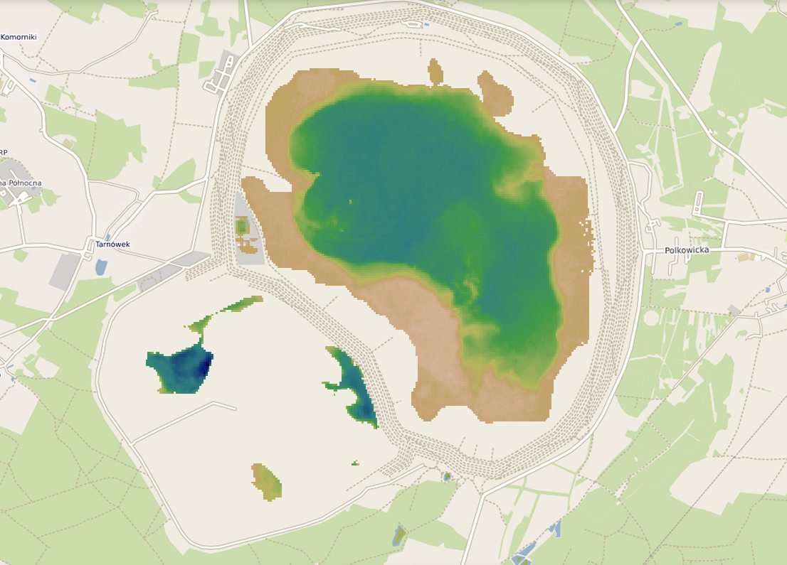

# Dissolved Organic Matter (DOM)

DOM includes a wide range of organic compounds dissolved in water from plant decay, runoff, or wastewater. It plays a key role in nutrient cycling and can affect water chemistry and quality.

Tracking DOM helps identify sources of organic pollution and assess ecosystem health.

*Żelazny Most (Near Lubina) - dissolved organic carbon DOC - Se2WaQ*

