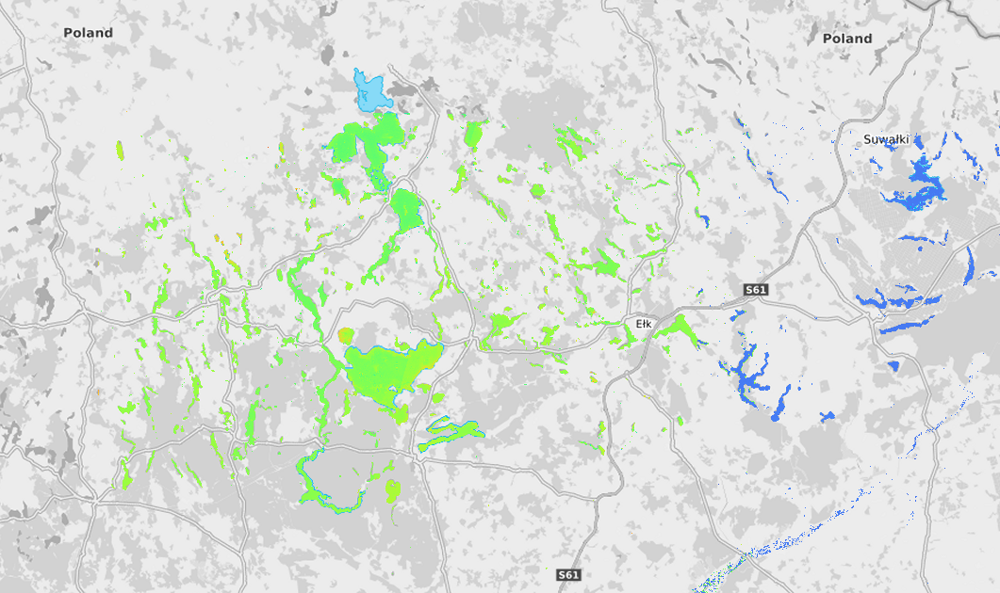

# Turbidity

Turbidity measures water clarity and is caused by suspended particles like sediment, algae, or pollutants. High turbidity reduces light penetration and can harm aquatic organisms.

It’s a simple yet powerful indicator of water disturbance or contamination.

*Mazury - turbidyty (turb - Se2WaQ)*

